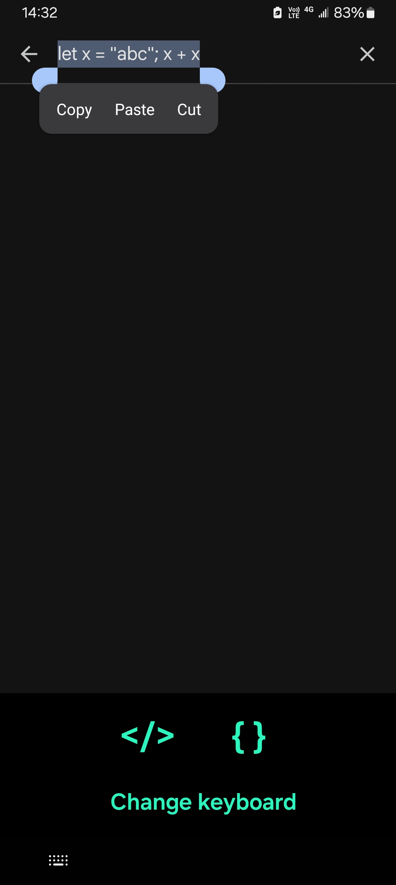
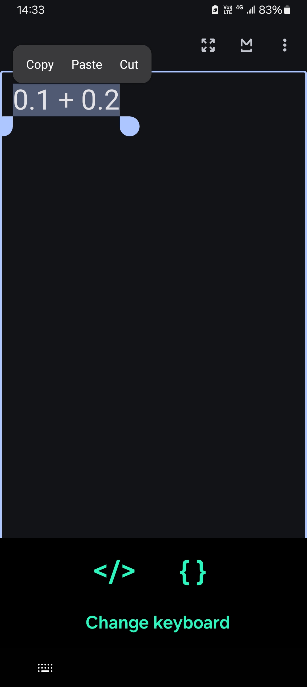

# Code Evaluator Keyboard

This is a keyboard (quasi input method) for evaluating HTML or JavaScript code on Android.

It has only three keys (buttons). The top-left button, which looks like the `</>` symbol, will evaluate any selected HTML code (plain text) and replace it with styled text (rich text). The top-right button, which looks like the `{ }` symbol, will evaluate any selected JavaScript code (plain text) and replace it with the result. And the button below them will allow you to switch to another keyboard, because this keyboard currently can't be used to type letters except by the method described above.

Now you can code everywhere. Every text input field is your coding environment. No need to switch to another app any more.

### Screenshots

### How it works

A very small, invisible instance of `WebView` is embedded in this keyboard to run the JavaScript code. When you select any code and click the button, the instance will run it, and the result will be inserted by this input method into the text you are editing. For HTML, this app utilizes the system API instead.

### Note

* This app can't access the internet. That means you can't do something like `location.href=...`. I mean you can do that, but it will have no effect. Instead, a small piece of sample HTML code is pre-loaded into the `WebView` instance embedded in the keyboard. You may change it by code but will not see any difference, because the `WebView` instance is invisible.

* The `</>` button (for HTML) might not work and can cause bugs in certain apps, where the input method is not supposed to be able to commit styled text. In some other apps, the style will be lost if it is not supported.

* This keyboard is considered an input method in the OS, so you have to enable it and switch to it as if it is one, but it current can't be used to type letters; such functionality is not yet implemented and might not be implemented in the future.